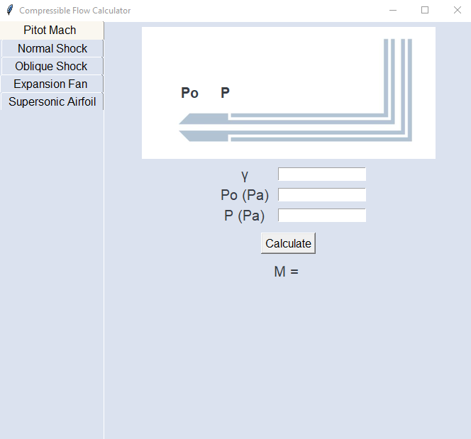
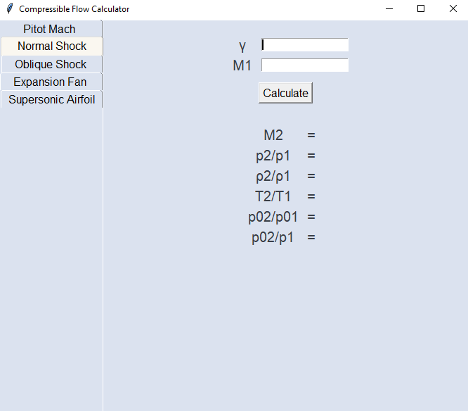
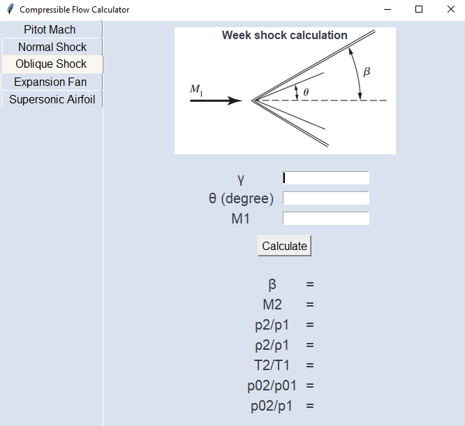
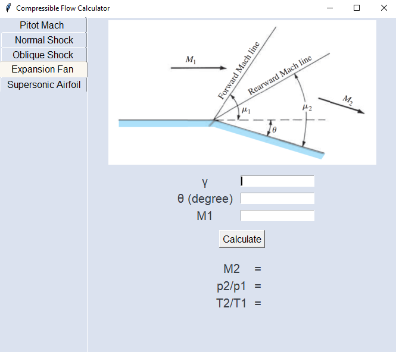
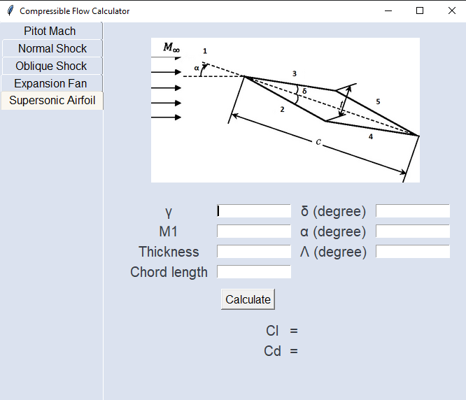

# Simple Python program for calculating basic compressible aerodynamics problems :
## Pitot Mach
Calculate Mach number from total and static pressure measured by a pitot tube:

  * Input : heat capacity ratio (γ), total pressure (Po), static pressure (P).
  * Output : free stream Mach number.
## Normal Shock
Calculate the Mach number, pressure ratio, density ratio, temperature ratio of air after/before a normal shockwave:

 * Input : heat capacity ratio (γ), Mach number of air before normal shock.
 * Output : ratios of air properties after/before normal shock.
## Oblique Shock
Calculate the Mach number, pressure ratio, density ratio, temperature ratio of air after/before a oblique shockwave:

 * Input : heat capacity ratio (γ), Mach number of air before oblique shock, deflection angle (θ).
 * Output : ratios of air properties after/before oblique shock.
## Expansion Fan
Calculate the Mach number, pressure ratio, temperature ratio of air after/before a supersonic expansion fan:

 * Input : heat capacity ratio (γ), Mach number of air before expansion fan, turn angle (θ).
 * Output : ratios of air properties after/before expansion fan.
## Supersonic Airfoil
Calculate the lift and drag coefficients of a double wedge airfoil:

  * Input : flow properties, airfoil shape.
  * Output : Lift and drag coefficients
